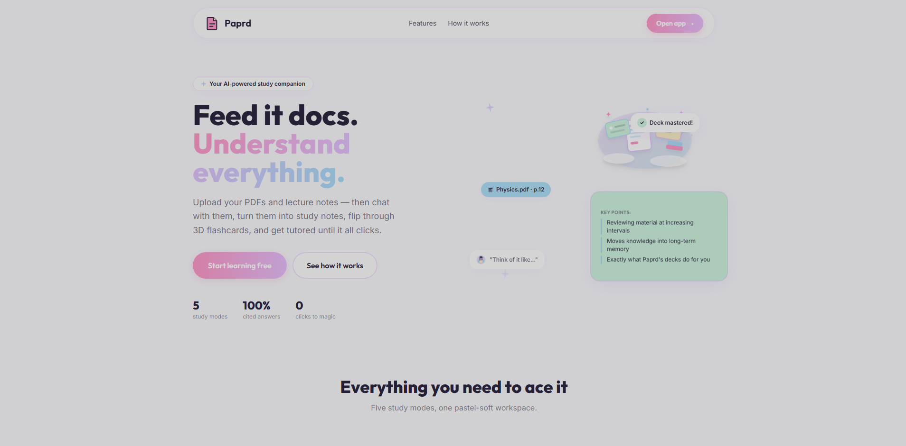

# 📄 Paprd

> **Feed it documents. Understand everything.**

Paprd is an AI-powered study companion that transforms your documents into an interactive learning experience. Upload PDFs or DOCX files, ask questions with cited answers, generate structured study notes, revise using 3D flashcards, and learn through an intelligent AI tutor—all in one place.

<p align="center">
  
</p>

## 🌐 Live Demo

🔗 **Live Website:** https://paprd-sand.vercel.app/

> **Note**
>
> The backend is deployed on **Render's Free Tier**. If the server has been inactive, the first request may take **2–3 minutes** while it wakes up. After that, the application responds normally.

---

# ✨ Features

### 📚 Smart Document Library

- Upload PDF and DOCX documents
- Automatic parsing and text extraction
- Intelligent chunking and embeddings
- Beautiful drag-and-drop interface
- Upload progress animations

---

### 💬 AI Document Chat

- Ask questions about your documents
- Retrieval-Augmented Generation (RAG)
- Source citations for every response
- Follow-up question suggestions
- Context-aware conversations

---

### 📝 AI Study Notes

- Automatically generate structured notes
- Clean and organized formatting
- Editable within the application
- Saved locally for future revisions

---

### 🎴 Interactive Flashcards

- AI-generated flashcards
- Premium 3D flip animations
- Shuffle decks
- "Got It" / "Review Again" tracking
- Progress overview

---

### 🧑‍🏫 AI Tutor

Learn your documents in multiple ways:

- Explain Like I'm Five (ELI5)
- Real-world analogies
- Interactive quizzes
- Personalized feedback
- Learning scorecards

---

# 🤖 AI Powered

Paprd combines **Retrieval-Augmented Generation (RAG)** with **Llama 3.3 70B** to deliver grounded, document-aware answers instead of generic AI responses.

Every answer references the exact source chunks used, making studying more reliable and transparent.

---

# 🛠 Tech Stack

## Frontend

- React 18
- TypeScript
- Vite
- Tailwind CSS
- Framer Motion
- Lenis

## Backend

- FastAPI
- Python 3.11+

## RAG Pipeline

- LangChain
- ChromaDB
- sentence-transformers
- all-MiniLM-L6-v2

## Document Processing

- PyMuPDF
- python-docx

## AI

- Groq API
- Llama 3.3 70B Versatile

---

# 📷 Screenshots

| Landing Page |
|--------------|
|  |

> You can also add screenshots for:
>
> - Document Library
> - AI Chat
> - Study Notes
> - Flashcards
> - AI Tutor

---

# 🚀 Getting Started

## Clone the Repository

```bash
git clone https://github.com/yourusername/paprd.git

cd paprd
```

---

## Backend

Create a `.env` file inside the backend directory.

```env
GROQ_API_KEY=your_api_key
```

Install dependencies:

```bash
cd backend

python -m venv venv

# Windows
venv\Scripts\pip install -r requirements.txt
```

Run the server:

```bash
venv\Scripts\uvicorn main:app --reload --port 8000
```

> **Note:** The first document upload downloads the embedding model (~90 MB). This happens only once.

---

## Frontend

```bash
cd frontend

npm install

npm run dev
```

Visit

```
http://localhost:5173
```

---

# 📁 Pages

| Route | Description |
|--------|-------------|
| `/` | Landing Page |
| `/library` | Upload & Manage Documents |
| `/ask` | AI Chat with Sources |
| `/notes` | AI Study Notes |
| `/flashcards` | Interactive Flashcards |
| `/tutor` | AI Tutor |

---

# 🔐 Authentication

Paprd includes a lightweight local authentication system.

- User Signup & Login
- PBKDF2 Password Hashing
- Session-based Authentication
- Protected Routes

---

# 🚀 Deployment

| Service | Platform |
|----------|----------|
| Frontend | Vercel |
| Backend | Render |
| Vector Database | ChromaDB |
| AI | Groq |
| Embeddings | sentence-transformers |

---

# 💡 Why Paprd?

Instead of reading hundreds of pages manually, Paprd lets you interact with your documents like a conversation.

Whether you're preparing for exams, revising lecture notes, or understanding research papers, Paprd helps you:

- Find answers instantly
- Generate concise study notes
- Revise efficiently with flashcards
- Learn concepts through an AI tutor
- Stay grounded with cited responses

---

## ⭐ If you found this project useful, consider giving it a star!
